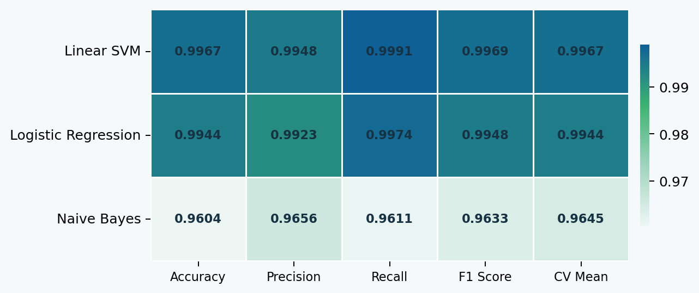
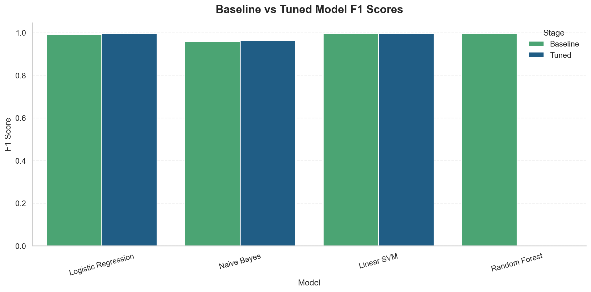
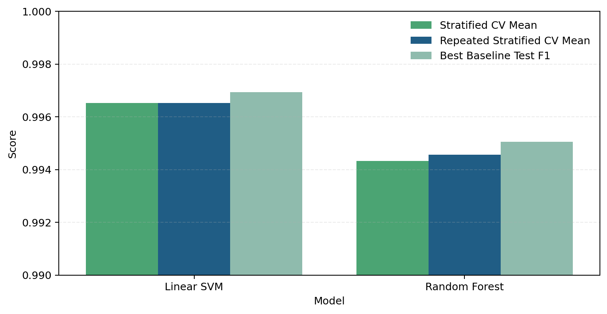
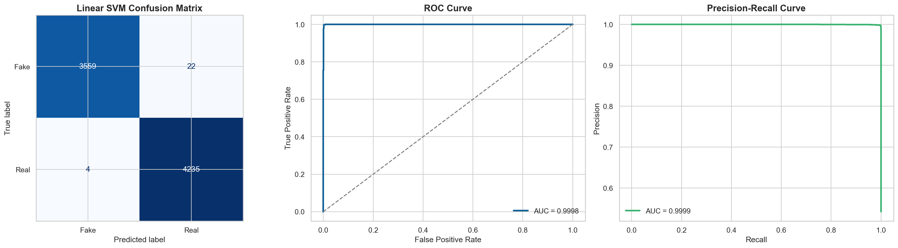

# Fake News Classification

This project implements a fake news classification workflow using classical machine learning for binary text classification. It includes a full training notebook, exported model artifacts, and a synchronized Streamlit app with `Predict`, `Dashboard`, and `News Classification Pipeline` tabs.

## Highlights

- End-to-end 11-stage fake news classification pipeline
- Classical ML workflow with TF-IDF features
- Baseline comparison across Logistic Regression, Naive Bayes, Linear SVM, and Random Forest
- Hyperparameter tuning with `GridSearchCV` and `RandomizedSearchCV`
- Synchronized Streamlit app aligned with the notebook preprocessing and model artifacts
- Dashboard tab with benchmark tables, metric heatmap, validation checks, and final evaluation visuals
- Pipeline tab showing the final methodology diagram used in the app

## Main Files

- `News_Classification.ipynb`
  Main notebook for preprocessing, training, tuning, evaluation, and artifact export.
- `AppNewsClassification.py`
  Main Streamlit deployment app aligned with the notebook outputs.
- `requirements.txt`
  Project dependencies.
- `assets/`
  Visual assets used by the app and the README.

## Application Overview

The Streamlit app is organized into three main sections:

- `Predict`
  Classify new article text as Fake News or Real News using the exported final pipeline.
- `Dashboard`
  Present benchmark outputs from the notebook in a cleaner interactive format.
- `News Classification Pipeline`
  Show the final pipeline diagram used for presentation and documentation.

## 11-Stage Pipeline

| Stage | Name | Description |
| --- | --- | --- |
| 01 | Problem and Dataset | Acquire the fake-news dataset and define the binary classification task |
| 02 | Data Understanding | Inspect structure, class balance, subject mix, and exploratory plots |
| 03 | Data Cleaning | Remove duplicates, standardize columns, and assemble the raw modeling text |
| 04 | Text Preprocessing | Normalize, clean, tokenize, remove stopwords, and lemmatize with POS tagging |
| 05 | Data Split | Perform stratified train/test split |
| 06 | Word Vectors | Transform cleaned text into TF-IDF vectors |
| 07 | ML Algorithm Building | Train baseline Logistic Regression, Naive Bayes, Linear SVM, and Random Forest |
| 08 | Hyperparameter Tuning | Run GridSearchCV and RandomizedSearchCV refinement |
| 09 | Tuned Model | Select the strongest tuned candidate using validation F1 |
| 10 | Evaluation | Inspect confusion matrix, ROC, PR curve, and benchmark comparisons |
| 11 | Prediction | Use the final synchronized pipeline for live inference |

## Pipeline Diagram

The app now uses a dedicated pipeline visual stored in `assets/PipeLine.png`.


## Dashboard Snapshots

The README below uses exported visuals from the current benchmark artifact and dashboard styling.

### Tuned Model Metric Heatmap



### Baseline vs Tuned Model F1 Scores



### Robust Validation Consistency



### Final Tuned Model Evaluation



## Final Notebook Results

The latest saved notebook artifacts identify **Linear SVM** as the final selected model.

| Model | Stage | Search Method | Accuracy | Precision | Recall | F1 Score | CV Mean |
| --- | --- | --- | ---: | ---: | ---: | ---: | ---: |
| Logistic Regression | Tuned | GridSearchCV | 0.9944 | 0.9923 | 0.9974 | 0.9948 | 0.9945 |
| Naive Bayes | Tuned | GridSearchCV | 0.9606 | 0.9659 | 0.9613 | 0.9636 | 0.9646 |
| Linear SVM | Tuned | RandomizedSearchCV | 0.9967 | 0.9948 | 0.9991 | 0.9969 | 0.9967 |
| Random Forest | Baseline | Baseline | 0.9941 | 0.9918 | 0.9974 | 0.9946 | 0.9943 |

Best saved model metadata:

- Best model: `Linear SVM`
- Saved slug: `linear_svm`
- TF-IDF configuration: `max_features=10000`, `ngram_range=(1, 2)`, `min_df=5`, `max_df=0.85`, `sublinear_tf=True`

## Preprocessing Flow

The notebook and the main app use the same preprocessing logic:

1. Text normalization
2. Text cleaning
3. Tokenization
4. Stopword removal
5. POS-aware lemmatization
6. Final cleaned text generation
7. TF-IDF vectorization
8. Model prediction

## Models Evaluated

- Logistic Regression
- Naive Bayes
- Linear SVM
- Random Forest

Validation uses `StratifiedKFold`, with additional repeated stratified cross-validation diagnostics for robustness checks.

## Repository Structure

```text
Fake-News-Classification/
|-- 📁 Dataset/
|-- 📁 Models/
|-- 📁 assets/
|-- AppNewsClassification.py
|-- News_Classification.ipynb
|-- README.md
`-- requirements.txt
```

## Important Folder Notes

- `Dataset/`
  Place the input CSV files here, such as `fake.csv` and `true.csv`.
- `Models/`
  Stores notebook-generated artifacts such as `best_model_pipeline.pkl`, `best_model_metadata.pkl`, `benchmark_results.pkl`, and other exported estimators.
- `assets/`
  Stores the pipeline image and README/dashboard screenshots.

## How To Reproduce

### 1. Install dependencies

```powershell
pip install -r requirements.txt
```

### 2. Prepare the dataset

Place the fake and real CSV files inside `Dataset/`.

### 3. Run the notebook

Open and run:

```text
News_Classification.ipynb
```

The notebook will:

- inspect and clean the dataset
- preprocess the text
- train and compare models
- tune shortlisted models
- evaluate the best model
- export trained `.pkl` artifacts into `Models/`

### 4. Run the Streamlit app

```powershell
streamlit run AppNewsClassification.py
```

## App Features

`AppNewsClassification.py` includes:

- fake/real news prediction from text input
- source-based sample loading for real and fake examples
- synchronized preprocessing trace display
- Dashboard tab with benchmark summaries and plots
- pipeline diagram tab using `assets/PipeLine.png`
- artifact-driven loading from `Models/`

## Saved Artifacts

After a successful notebook run, the `Models` folder should contain files such as:

- `benchmark_results.pkl`
- `best_model_estimator.pkl`
- `best_model_metadata.pkl`
- `best_model_pipeline.pkl`
- `tfidf_vectorizer.pkl`
- model-specific pipelines and estimators

## Recommended Entry Point

For presentation or submission, use:

```text
AppNewsClassification.py
```

This is the version currently aligned with the notebook pipeline, dashboard outputs, and final UI refinements.

## License

This repository includes the existing `LICENSE` file from the project root.
